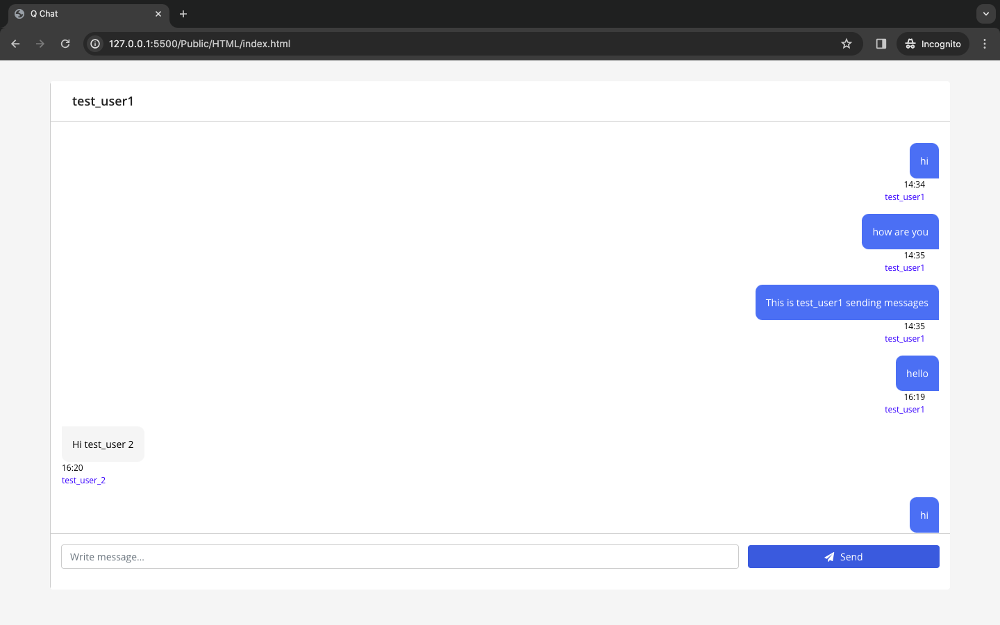

---

# Real-Time Chat Application



---

## Overview

This project is a real-time chat application leveraging Node.js, Express, Mongoose, and MongoDB for database storage, with JWT for secure authentication. It enables instant messaging between users and utilizes various technologies for a seamless chat experience.
---
## Features

- **Real-Time Messaging**: Enables instantaneous communication between users using Scoket.io.
- **User Authentication**: JWT-based authentication for secure access.
- **Logging**: Utilizes Winston for efficient logging.
- **Data Validation**: Implements Joi for robust request body validation.
- **Database**: MongoDB provides scalable and efficient data storage.
---
## Tech Stack

- **Backend**: Node.js, Express
- **Database**: MongoDB, Mongoose
- **Authentication**: JWT
- **Logging**: Winston
- **Request Validation**: Joi
---
## Prerequisites

Ensure the following are installed:

- Node.js
- Git
---
## Installation

1. Clone the repository:

   ```bash
   git clone https://github.com/MudassirQuraishi/Minimalistic_Real_Time_Chat_Evivve.git
   ```

2. Install dependencies:

   ```bash
   cd Minimalistic_Real_Time_Chat_Evivve
   npm install
   ```

3. Set Environment Variables:

   Create a `.env` file in the root directory with:

   ```plaintext
   MONGODB_URL=your_mongodb_url
   PORT=3000
   JWT_SECRET_KEY=your-secret-key
   ```

   Replace `your-secret-key` with your chosen JWT secret.
---
## Usage

1. Start the server:

   ```bash
   npm start
   ```

2. Access the application at `http://localhost:3000`.
---
## API Documentation  

- Access the detailed API documentation [here](https://documenter.getpostman.com/view/28397772/2s9Ykq8LkH) for endpoint descriptions and usage.

---
## License

This project is licensed under the [MIT_License](LICENSE).

